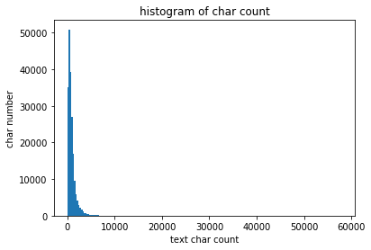
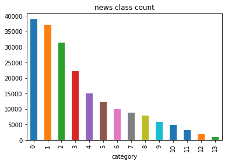

# 新闻文本分类
## 一、赛题数据
赛题以新闻数据为赛题数据，数据集报名后可见并可下载。赛题数据为新闻文本，并按照字符级别进行匿名处理。
整合划分出14个候选分类类别：财经、彩票、房产、股票、家居、教育、科技、社会、时尚、时政、体育、星座、游戏、娱乐的文本数据。
赛题数据由以下几个部分构成：训练集20w条样本，测试集A包括5w条样本，测试集B包括5w条样本。
## 二、数据标签
在数据集中标签的对应的关系如下：
```python
{'科技': 0, '股票': 1, '体育': 2, '娱乐': 3, '时政': 4, '社会': 5, '教育': 6, '财经': 7, '家居': 8, '游戏': 9, '房产': 10, '时尚': 11, '彩票': 12, '星座': 13}
```
## 三、思路分析
赛题思路分析：赛题本质是一个文本分类问题，需要根据每句的字符进行分类。但赛题给出的数据是匿名化的，不能直接使用中文分词等操作，这个是赛题的难点。

因此本次赛题的难点是需要对匿名字符进行建模，进而完成文本分类的过程。由于文本数据是一种典型的非结构化数据，因此可能涉及到特征提取和分类模型两个部分。为了减低参赛难度，我们提供了一些解题思路供大家参考：

- 思路1：TF-IDF + 机器学习分类器
直接使用TF-IDF对文本提取特征，并使用分类器进行分类。在分类器的选择上，可以使用SVM、LR、或者XGBoost。
 
- 思路2：FastText
FastText是入门款的词向量，利用Facebook提供的FastText工具，可以快速构建出分类器。

- 思路3：WordVec + 深度学习分类器
WordVec是进阶款的词向量，并通过构建深度学习分类完成分类。深度学习分类的网络结构可以选择TextCNN、TextRNN或者BiLSTM。

- 思路4：Bert词向量
Bert是高配款的词向量，具有强大的建模学习能力。


```python
import os
import numpy
import pandas as pd
import matplotlib.pyplot as plt
```


```python
print(os.getcwd())
```

    /Users/chenyifan/Desktop/研二/github/nlp_learning


```python
train = pd.read_csv("./train_set.csv", sep = '\t')
train
```


<div>
<style scoped>
    .dataframe tbody tr th:only-of-type {
        vertical-align: middle;
    }

    .dataframe tbody tr th {
        vertical-align: top;
    }

    .dataframe thead th {
        text-align: right;
    }
</style>
<table border="1" class="dataframe">
  <thead>
    <tr style="text-align: right;">
      <th></th>
      <th>label</th>
      <th>text</th>
    </tr>
  </thead>
  <tbody>
    <tr>
      <th>0</th>
      <td>2</td>
      <td>2967 6758 339 2021 1854 3731 4109 3792 4149 15...</td>
    </tr>
    <tr>
      <th>1</th>
      <td>11</td>
      <td>4464 486 6352 5619 2465 4802 1452 3137 5778 54...</td>
    </tr>
    <tr>
      <th>2</th>
      <td>3</td>
      <td>7346 4068 5074 3747 5681 6093 1777 2226 7354 6...</td>
    </tr>
    <tr>
      <th>3</th>
      <td>2</td>
      <td>7159 948 4866 2109 5520 2490 211 3956 5520 549...</td>
    </tr>
    <tr>
      <th>4</th>
      <td>3</td>
      <td>3646 3055 3055 2490 4659 6065 3370 5814 2465 5...</td>
    </tr>
    <tr>
      <th>5</th>
      <td>9</td>
      <td>3819 4525 1129 6725 6485 2109 3800 5264 1006 4...</td>
    </tr>
    <tr>
      <th>6</th>
      <td>3</td>
      <td>307 4780 6811 1580 7539 5886 5486 3433 6644 58...</td>
    </tr>
    <tr>
      <th>7</th>
      <td>10</td>
      <td>26 4270 1866 5977 3523 3764 4464 3659 4853 517...</td>
    </tr>
    <tr>
      <th>8</th>
      <td>12</td>
      <td>2708 2218 5915 4559 886 1241 4819 314 4261 166...</td>
    </tr>
    <tr>
      <th>9</th>
      <td>3</td>
      <td>3654 531 1348 29 4553 6722 1474 5099 7541 307 ...</td>
    </tr>
    <tr>
      <th>10</th>
      <td>0</td>
      <td>3659 3659 1903 1866 4326 4744 7239 3479 4261 4...</td>
    </tr>
    <tr>
      <th>11</th>
      <td>7</td>
      <td>6469 1066 1623 1018 3694 4089 3809 4516 6656 3...</td>
    </tr>
    <tr>
      <th>12</th>
      <td>4</td>
      <td>3772 4269 3433 6122 2035 4531 465 6565 498 358...</td>
    </tr>
    <tr>
      <th>13</th>
      <td>0</td>
      <td>4630 2210 1641 1854 1641 4543 3017 4409 5430 6...</td>
    </tr>
    <tr>
      <th>14</th>
      <td>0</td>
      <td>1103 6835 3433 2107 5165 7543 3598 5229 1946 2...</td>
    </tr>
    <tr>
      <th>15</th>
      <td>1</td>
      <td>4412 5988 5036 4216 7539 5644 1906 2380 2252 6...</td>
    </tr>
    <tr>
      <th>16</th>
      <td>1</td>
      <td>2400 4411 5968 2612 6920 4464 3659 6250 2799 5...</td>
    </tr>
    <tr>
      <th>17</th>
      <td>2</td>
      <td>2410 6587 6644 2727 4109 5247 5310 5547 5949 7...</td>
    </tr>
    <tr>
      <th>18</th>
      <td>4</td>
      <td>3170 3508 4163 2974 1952 4417 4987 5505 4163 2...</td>
    </tr>
    <tr>
      <th>19</th>
      <td>2</td>
      <td>4269 3772 5445 2289 2109 5410 1991 5589 2986 1...</td>
    </tr>
    <tr>
      <th>20</th>
      <td>0</td>
      <td>6569 4690 2663 5391 1315 3987 1519 4893 7539 3...</td>
    </tr>
    <tr>
      <th>21</th>
      <td>1</td>
      <td>3017 505 1070 1036 2621 4480 5117 3772 4786 56...</td>
    </tr>
    <tr>
      <th>22</th>
      <td>2</td>
      <td>3263 6104 7539 5744 2827 2367 4893 1647 4315 1...</td>
    </tr>
    <tr>
      <th>23</th>
      <td>2</td>
      <td>3418 1939 220 6886 623 149 1679 3099 1324 7543...</td>
    </tr>
    <tr>
      <th>24</th>
      <td>12</td>
      <td>314 4261 1667 2810 2334 5176 2376 4646 478 132...</td>
    </tr>
    <tr>
      <th>25</th>
      <td>4</td>
      <td>7154 2592 5562 2828 4559 2376 5780 3650 3203 5...</td>
    </tr>
    <tr>
      <th>26</th>
      <td>3</td>
      <td>1965 2717 2728 1951 3744 4831 5698 3915 5099 5...</td>
    </tr>
    <tr>
      <th>27</th>
      <td>4</td>
      <td>6861 6654 1362 4333 3272 1697 7044 1519 4516 4...</td>
    </tr>
    <tr>
      <th>28</th>
      <td>1</td>
      <td>1141 5915 6178 4842 6725 7261 7408 4671 6846 5...</td>
    </tr>
    <tr>
      <th>29</th>
      <td>1</td>
      <td>2289 6357 3577 751 2402 3377 5589 4853 7467 51...</td>
    </tr>
    <tr>
      <th>...</th>
      <td>...</td>
      <td>...</td>
    </tr>
    <tr>
      <th>199970</th>
      <td>7</td>
      <td>6835 5296 1854 5036 1844 2400 2438 6093 3961 1...</td>
    </tr>
    <tr>
      <th>199971</th>
      <td>4</td>
      <td>56 4411 5410 1215 3912 1829 6613 1563 4040 125...</td>
    </tr>
    <tr>
      <th>199972</th>
      <td>0</td>
      <td>623 6637 6680 4893 4063 6111 5330 2465 1744 41...</td>
    </tr>
    <tr>
      <th>199973</th>
      <td>0</td>
      <td>4923 7449 3055 1116 2289 1736 531 7539 5269 18...</td>
    </tr>
    <tr>
      <th>199974</th>
      <td>1</td>
      <td>2642 4909 7306 2549 7539 3107 2549 2328 2164 5...</td>
    </tr>
    <tr>
      <th>199975</th>
      <td>2</td>
      <td>3661 1731 6352 3508 531 4998 5315 851 5530 663...</td>
    </tr>
    <tr>
      <th>199976</th>
      <td>2</td>
      <td>6405 3203 6644 4350 3568 5094 5221 4958 3608 7...</td>
    </tr>
    <tr>
      <th>199977</th>
      <td>2</td>
      <td>6227 6227 4333 4183 3792 2490 3971 408 671 715...</td>
    </tr>
    <tr>
      <th>199978</th>
      <td>2</td>
      <td>4173 5603 4960 150 2679 2376 5530 5057 669 356...</td>
    </tr>
    <tr>
      <th>199979</th>
      <td>2</td>
      <td>6549 2313 3743 6065 4464 7543 4173 2828 3012 5...</td>
    </tr>
    <tr>
      <th>199980</th>
      <td>5</td>
      <td>1334 3923 7532 6045 4553 4775 3018 7013 6983 4...</td>
    </tr>
    <tr>
      <th>199981</th>
      <td>5</td>
      <td>6357 150 4233 23 4811 2334 3317 7010 5282 3971...</td>
    </tr>
    <tr>
      <th>199982</th>
      <td>4</td>
      <td>4411 150 5480 307 6973 2364 3648 5370 2380 620...</td>
    </tr>
    <tr>
      <th>199983</th>
      <td>1</td>
      <td>847 3809 5385 281 4301 3560 3809 3694 299 6656...</td>
    </tr>
    <tr>
      <th>199984</th>
      <td>0</td>
      <td>7544 134 5659 6065 4646 3370 803 469 7047 2415...</td>
    </tr>
    <tr>
      <th>199985</th>
      <td>0</td>
      <td>5057 1859 7449 4659 4543 3976 2465 2515 3329 2...</td>
    </tr>
    <tr>
      <th>199986</th>
      <td>3</td>
      <td>141 6956 7528 7495 7354 5681 5530 2112 3000 28...</td>
    </tr>
    <tr>
      <th>199987</th>
      <td>2</td>
      <td>3000 3148 5139 5977 2490 1308 5498 2289 2614 2...</td>
    </tr>
    <tr>
      <th>199988</th>
      <td>4</td>
      <td>517 5620 2986 7539 2255 3915 5445 1460 6587 42...</td>
    </tr>
    <tr>
      <th>199989</th>
      <td>1</td>
      <td>3469 3772 3117 4413 2313 3743 1070 2107 2621 5...</td>
    </tr>
    <tr>
      <th>199990</th>
      <td>4</td>
      <td>6811 1580 7539 6193 5169 7219 2022 5296 2364 4...</td>
    </tr>
    <tr>
      <th>199991</th>
      <td>2</td>
      <td>5511 4893 2115 5192 3934 6256 3554 2457 2282 1...</td>
    </tr>
    <tr>
      <th>199992</th>
      <td>0</td>
      <td>3479 6662 1913 4641 2465 2465 495 4516 1146 69...</td>
    </tr>
    <tr>
      <th>199993</th>
      <td>0</td>
      <td>1363 4409 2210 3961 5736 2539 3012 2380 5689 2...</td>
    </tr>
    <tr>
      <th>199994</th>
      <td>3</td>
      <td>1640 5310 2923 913 7109 6992 6722 6337 3982 73...</td>
    </tr>
    <tr>
      <th>199995</th>
      <td>2</td>
      <td>307 4894 7539 4853 5330 648 6038 4409 3764 603...</td>
    </tr>
    <tr>
      <th>199996</th>
      <td>2</td>
      <td>3792 2983 355 1070 4464 5050 6298 3782 3130 68...</td>
    </tr>
    <tr>
      <th>199997</th>
      <td>11</td>
      <td>6811 1580 7539 1252 1899 5139 1386 3870 4124 1...</td>
    </tr>
    <tr>
      <th>199998</th>
      <td>2</td>
      <td>6405 3203 6644 983 794 1913 1678 5736 1397 191...</td>
    </tr>
    <tr>
      <th>199999</th>
      <td>3</td>
      <td>4350 3878 3268 1699 6909 5505 2376 2465 6088 2...</td>
    </tr>
  </tbody>
</table>
<p>200000 rows × 2 columns</p>
</div>


## 赛题数据信息


```python
train.info()
```

    <class 'pandas.core.frame.DataFrame'>
    RangeIndex: 200000 entries, 0 to 199999
    Data columns (total 2 columns):
    label    200000 non-null int64
    text     200000 non-null object
    dtypes: int64(1), object(1)
    memory usage: 3.1+ MB


## 分布规律


```python
train['text_len'] = train['text'].apply(lambda x: len(x.split()))
train['text_len'].describe()
```


    count    200000.000000
    mean        907.207110
    std         996.029036
    min           2.000000
    25%         374.000000
    50%         676.000000
    75%        1131.000000
    max       57921.000000
    Name: text_len, dtype: float64


## 画直方图


```python
_ = plt.hist(train['text_len'], bins = 200)
plt.xlabel('text char count')
plt.ylabel('char number')
plt.title('histogram of char count')
```


    Text(0.5,1,'histogram of char count')





## 在数据集中标签的对应关系如下：{‘科技’: 0, ‘股票’: 1, ‘体育’: 2, ‘娱乐’: 3, ‘时政’: 4, ‘社会’: 5, ‘教育’: 6, ‘财经’: 7, ‘家居’: 8, ‘游戏’: 9, ‘房产’: 10, ‘时尚’: 11, ‘彩票’: 12, ‘星座’: 13}


```python
train['label'].value_counts().plot(kind='bar')
plt.xlabel('category')
plt.title('news class count')
```


    Text(0.5,1,'news class count')





## 字符统计
接下来可以统计每个字符出现的次数，首先可以将训练集中所有的句子进行拼接进而划分为字符，并统计每个字符的个数。
从统计结果中可以看出，在训练集中总共包括44374个字，其中编号3750的字出现的次数最多.


```python
from collections import Counter #计数器
all_lines = ' '.join(list(train['text']))
word_count = Counter(all_lines.split())
word_count = sorted(word_count.items(), key = lambda x:int(x[1]), reverse = True)
print(len(word_count))
print(word_count[0])
print(word_count[1])
print(word_count[2])
```

    6869
    ('3750', 7482224)
    ('648', 4924890)
    ('900', 3262544)


```python
train['text_unique'] = train['text'].apply(lambda x:' '.join(list(set(x.split()))))
all_lines_2 = ' '.join(list(train['text_unique']))
word_count_frequence = Counter(all_lines_2.split())
word_count_frequence = sorted(word_count_frequence.items(), key = lambda d:int(d[1]), reverse = True)
print(word_count_frequence[0])
print(word_count_frequence[1])
print(word_count_frequence[2])
####参考资料是骗子 根本就不能出现99%这种频率 需要再处理一下
##？？？？？？但是 这个貌似字典的玩意 怎么把值取出来算频率呢？？？？？？？？
哦会了
word_count_frequence[2][1]/20000就行
```

    ('3750', 197997)
    ('900', 197653)
    ('648', 191975)


## 总结数据分布 哈哈哈哈哈哈哈哈哈

- 一共两万条新闻，平均每个新闻907个字，最少的2个字，最多57921.
- 科技类新闻最多，快四万了；星座最少（应该的，，这玩意我都不看了，我这狮子座也不像狮子座啊！）
- 3750 900 648，在20w新闻里出现频率最高，可能是标点符号。
**底下是牛皮的参考文件写的**
- 每个新闻平均字符个数较多，可能需要截断；
- 由于类别不均衡，会严重影响模型的精度；

